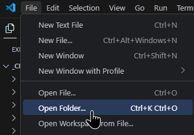
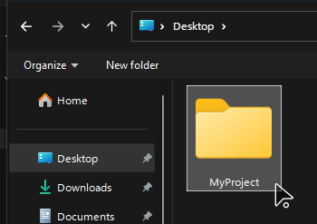
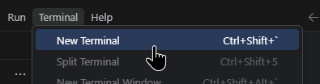
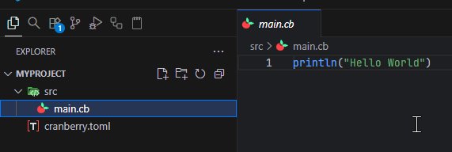
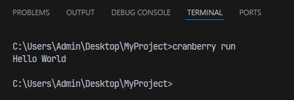

We'll be using [Visual Studio Code](https://code.visualstudio.com/) (VSCode) for this tutorial so please install that.

Open VSCode and open a new folder:



We'll create a folder in Desktop called `"MyProject"` as an example. Select it and use it.



VSCode will open that folder and you should see an empty project. Go to the top of the screen and select `Terminal > New Terminal`.



Inside the terminal write the following command:

```bash
cranberry init
```

That will initialize a new cranberry project in the current working directory.
You should see this file structure:

```bash
MyProject/
├─ src/           # Contains all source cranberry files
│  ├─ main.cb         # Main entry point of cranberry
└─ cranberry.toml # Edit cranberry project settings
```

Open up the `main.cb` file inside of `src/` and see its contents:



## Running the Project

Go back to the Terminal and write the following command:

```bash
cranberry run
```

This will run the project and you'll see this in the output:


