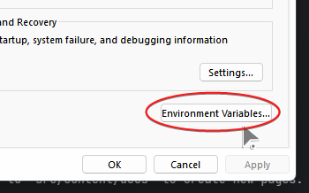

1. To install Cranberry, go to the [github releases](https://github.com/creepersaur/Cranberry-Lang/releases) page and and get the latest release.

2. Download the `Cranberry.7z` file, extract it and put it somewhere safe.
(Like in `Documents/Cranberry`.)


3. Open the start menu and search for "Edit the system environment variables".


4. Go to Advanced > Environment Variables



5. Select `Path` and hit `Edit`. Then add the path to the Cranberry installation folder.


6. When you're done click Apply and OK.

## Checking if Install is Successful

Press `Win + R` and type in "cmd". And inside of the command prompt write.

```bash
cranberry
```

If everything is correct then you should see the Cranberry help splash.
