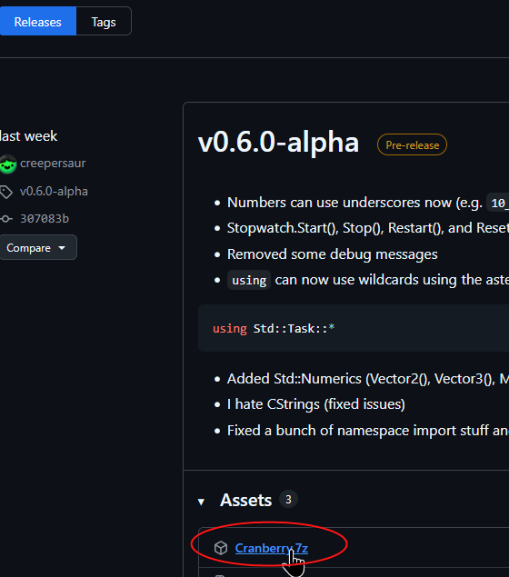
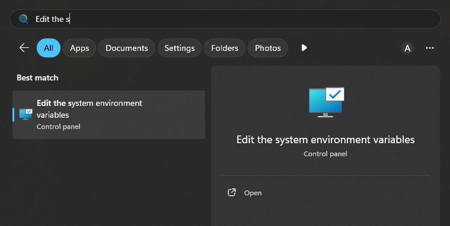
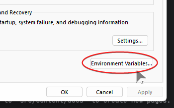
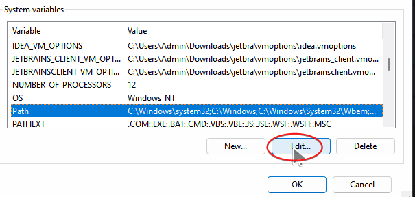

import { Aside, Tabs, TabItem } from '@astrojs/starlight/components';

## Windows

1. To install Cranberry, go to the [GitHub Releases](https://github.com/creepersaur/Cranberry-Lang/releases) page and and get the latest release.

2. Download the `Cranberry.7z` file, extract it and put it somewhere safe.
(Like in `Documents/Cranberry`.)



3. Open the start menu and search for "Edit the system environment variables".



4. Go to Advanced > Environment Variables



5. Select `Path` and hit `Edit`. Then add the path to the Cranberry installation folder.



6. When you're done click Apply and OK.

<Aside>
    Please install all dependencies given in the next part
</Aside>

## Linux

<Aside type="caution">
    When copying any commands, please make sure to change `[version]` to the 
    actual Cranberry version you downloaded.
</Aside>

Precompiled Linux binaries are available since version 0.8.0-alpha, with the 
file named `cranberry-[version]-linux-x64.tar.zst` (Zstandard-compressed Tar)

You can simply download the precompiled binary from 
[GitHub Releases](https://github.com/creepersaur/Cranberry-Lang/releases)
and extract it using your preferred program or use the command 
`tar xf cranberry-[version]-linux-x64.tar.zst`.

After extracting, a folder named `cranberry-[version]` will appear. Feel free 
to move that folder around and place it wherever you like.

Next, Follow one of these instructions to add cranberry to the PATH of your 
shell. *For Linux beginners, If you haven't changed your default shell, You 
are very likely using Bash.*

<Tabs>
    <TabItem label="Bash">
        Replace the `/path/to/cranberry` with the actual path in the following line and add it to your `~/.bash_profile`
        ```bash
export PATH="/path/to/cranberry:$PATH"
        ```

        For example, If you placed Cranberry at `/home/user/cranberry`, You would add the following:
        ```bash
export PATH="$HOME/cranberry:$PATH"
        ```
    </TabItem>
    <TabItem label="Zsh">
        Replace the `/path/to/cranberry` with the actual path in the following line and add it to your `~/.zshrc`
        ```bash
export PATH="/path/to/cranberry:$PATH"
        ```

        For example, If you placed Cranberry at `/home/user/cranberry`, You would add the following:
        ```bash
export PATH="$HOME/cranberry:$PATH"
        ```
    </TabItem>
    <TabItem label="Fish">

        Replace the `/path/to/cranberry` with the actual path in the following command and run it
        ```bash
fish_add_path -g -p /path/to/cranberry
        ```

        For example, If you placed Cranberry at `/home/user/cranberry`, You would run the following:
        ```bash
fish_add_path -g -p ~/cranberry
        ```
    </TabItem>
    <TabItem label="Sh">
        Replace the `/path/to/cranberry` with the actual path in the following line and add it to your `~/.profile`
        ```bash
export PATH="/path/to/cranberry:$PATH"
        ```

        For example, If you placed Cranberry at `/home/user/cranberry`, You would add the following:
        ```bash
export PATH="$HOME/cranberry:$PATH"
        ```
    </TabItem>
</Tabs>

Next, Restart your terminal to apply the new configuration. (there are faster 
ways to reload configuration but this should work universally)

Then, You can move on to the next step and install Cranberry's dependencies.
